# Testing Log 

## Table of Contents

1. [**Hello World AWS-Vitis Example**](#hello-world-(aws-vitis-example))
2. [**Loop Reorder AWS Example**](#loop-reorder-(aws-vitis-example))
3. [**HPCC_FPGA Linpack Failed Benchmark**](#hpcc_fpga-linpack-failed-benchmark)
4. [**HPCC_FPGA Failure Log**](#hpcc_fpga-failure-log)
5. [**HPCG_FPGA Testing Log**](#hpcg_fpga-testing-log)

This testing log is included for the purposes of documenting what errors or other interesting situations occured while working on this project. As such, this specific file will be mostly long, I would suggest using ctrl+f to find a specific situation if needed rather than reading through the entire thing. Note that many of the files or scripts I refer to in this document are images, primarily for the purpose of pointing things out. Most files will be found on this project's github. 

## Hello World (AWS-Vitis Example)

The AWS-FPGA github repo suggest going through the Hello World Quickstart example when first getting f1 instances setup. Because this was the first example tested during this project, I went through and completed an emulation of the FPGA binaries, as to see how they work and how the process differs between emulating and building the binaries. It appears that this hello world example is meant to show vector addition based on the name of the executable "vadd". More documentation on this example can be found [here](https://xilinx.github.io/Vitis_Accel_Examples/2022.1/html/hello_world.html).

The Hello World example is part of the quickstart and has a dedicated folder within the "Vitis/examples/Xilinx.../hello_world" directory. 

To emulate the FPGA binaries, I ran the following commands: 

    cd $VITIS_DIR/examples/Xilinx/hello_world
    make clean
    make TARGET=sw_emu DEVICE=$AWS_PLATFORM all

The image below describes the results of the binary emulation process: 
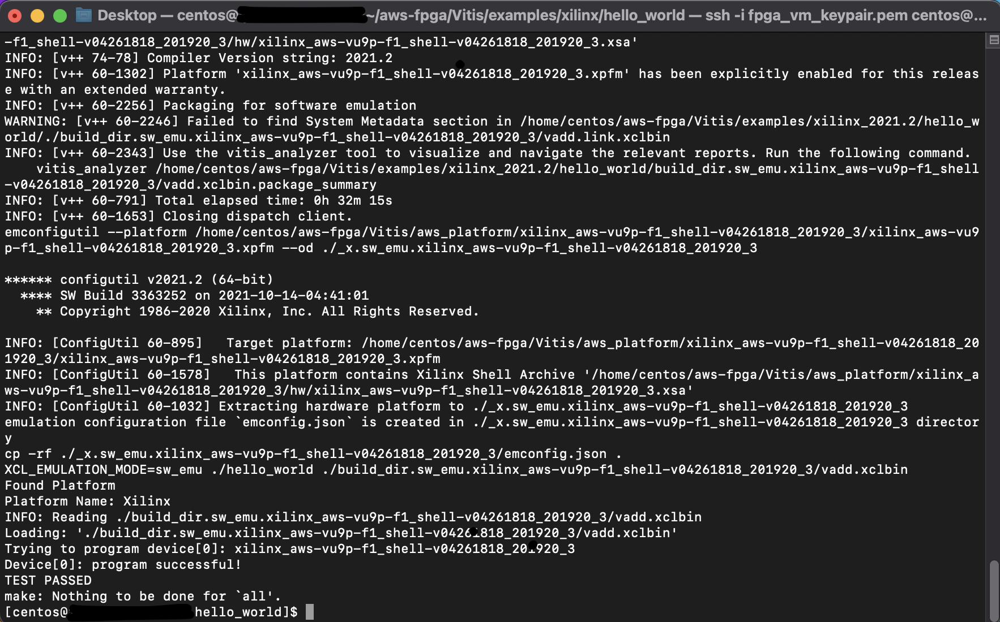

As mentioned in the [Getting Started](/techInfo/#compiling-and-deploying-fpga-code-to-an-f1-instance) page, changing the TARGET parameter when executing the make file determines whether the FPGA binary files are built or emulated in software/hardware. The results of the test shown above are the results of software emulation, although hardware emulation is preferrred. Because the "Hello World" example is provided by AWS, there is no real need to emulate the binary, but it does show what the proces of emulating vs building the binaries is like.  

We know the the emulation completed sucessfully or as intended, as there is a `TEST PASSED` message in the third to last line of the console.

To compile the FPGA binaries, I ran the same commands, only changing the TARGET parameter after `make clean` in the same directory:

    make clean 
    make TARGET=hw DEVICE=$AWS_PLATFORM all

After confirming that the emulation and compilation completed successfully, I ran the following commands to generate the F1 AFI or Amazon FPGA Image: 

    cd $VITIS_DIR/tools
    ./create_vitis_afi.sh -xclbin=../examples/xilinx/hello_world/build_dir.hw.xilinx_aws-vu9p-f1_shell-v04261818_201920_3/vadd.xclbin -o=vadd -s3_bucket=REDACTED -s3_dcp_key=REDACTED -s3_logs_key=REDACTED

*Note: Generating the AFI requires knowing the path from the Vitis/tools directory to the target executable and the .xclbin file.*

The following image shown below describes the results of the completed test running on the f1 instance: 
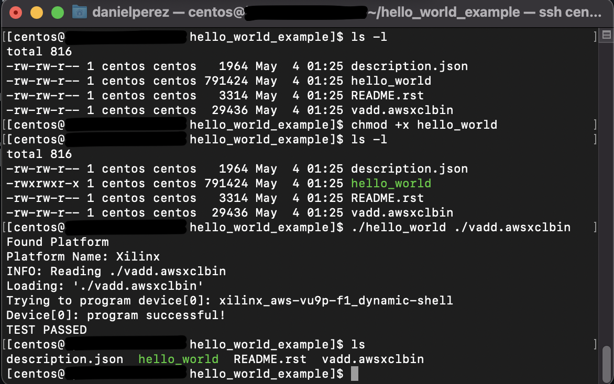

Just like with the emulation of the FPGA binaries, there is a `TEST PASSED` message on the second to last line of the console, indicating that the FPGA binaries completed exeecution as expected on the f1 instance.

## Loop Reorder (AWS-Vitis Example) 

The Loop Reorder is the second example I tested when AWS F1 instances.
The screenshot below describes the results of the loop reorder test:  

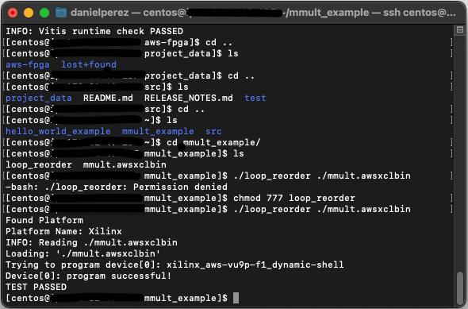

## HPCC_FPGA Linpack Failed Benchmark

The Linpack benchmark is the third example I tested, although it was not a part of the AWS-Vitis examples provided in either the AWS github or the Vitis-Examples Website. The Linpack benchmark is a well-established HPC benchmark used to determine the speed of the fastest supercomputers on the planet. 

While reading through the instructions for building LINPACK I realized I had to install cmake, as it was not already installed on my AWS instance. The reason I installed cmake3 instead of just cmake is because a version of cmake above 3.0 was required to run the cmake build files. My install of just "cmake" was not of a high enough version to run the cmake files.  

    sudo yum install cmake3

After installing and running `cmake3` (as `cmake` did not work), I received a variety of different errors regarding dependencies. One such dependecy that gave me issues was the package for MPI. I received an MPI error, and for some reason, there are certain issues with installing the MPI package in CENTOS. The command `sudo yum install mpich-3.2-autoload` seemed to finally recognize the mpirun command after logging in and out of the instance. Neither the regular or the package labeled 'devel' were correct. I also reccomend running `source vitis_setup.sh` in the aws-fpga local repo.

After running CMake again, I received 3 errors: 

    -- Could NOT find Vitis (missing: Vitis_INCLUDE_DIRS Vitis_FLOATING_POINT_LIBRARY) 
    ERRORXilinx Vitis or Intel FPGA OpenCL SDK required!
    ERRORNo OpenCL header found on system!
    -- Could NOT find BLAS (missing: BLAS_LIBRARIES) 
    -- LAPACK requires BLAS
    -- A library with LAPACK API not found. Please specify library location.
    CMake Warning at tests/CMakeLists.txt:5 (message):
    LAPACK not found! Some tests need LAPACK to run.  They will be disabled!

I had to also install the lapack-devel and the blas-devel packages in order to get LINPACK to make properly. `sudo yum install blas-devel lapack-devel`. I will make sure to write a note at the beginning of this section explaining what packages need to be installed, as to make sure this is not as much of an issue for other individuals trying to replicate this process.  

I continued to have issues and tried declaring the path to the missing Vitis modules expliticly using the following command: 

cmake3 .. -DVitis_INCLUDE_DIRS=/opt/Xilinx/Vitis_HLS/2021.2/include -DVitis_FLOATING_POINT_LIBRARY=/opt/Xilinx/Vitis_HLS/2021.2/lnx64/tools/fpo_v7_0/floating_point_v7_0_bitacc_cmodel.h -DVitis_HLS=opt/Xilinx/Vitis_HLS/2021.2/bin/vitis_hls

Which worked when getting the GEMM benchmark host application build, but did not work here. After I tried running this the first time, the INCLUDE_DIRS error was gone, but I still had the HLS and the FLOATING_POINT_LIBRARY flags giving me an error. 

I brought it down to 2 main errors: Vitis_HLS still for some reason is not being detected even after passing the path in the cmake command directly, and for some reason the OpenCL headers are not being detected. I believe they may need to be either installed seperately or may be a part of Xilinx XRT/Vitis but are not being properly detected because of the aforementioned issues. 

I was not able to solve these issues, and even had more major issues with the other benchmarks, more details are in the [next](#hpcc_fpga-failure-log) section. 

## HPCC_FPGA Failure Log

After having failed to get the LINPACK benchmark working, I switched to trying to get GEMM to work. I managed to avoid the last issue with the missing Vitis_HLS and get the host application to build, but still failed to get the FPGA binaries to build properly.

The issues I encountered were the following: 
1. Incorrect/Out-of-Date Documentation
2. Vitis Version Incompatibilities (+ other uncontrollable issues)
3. Missing Vitis Files

In terms of Incorrect/Out-of-Date Documentation, the HPCC_FPGA readme's on their git repo for the benchmarks I attempted were incomplete, especially in terms of the makefile targets. The documentation site indicates that `make help` will indicate what makefile targets are available, but this simply indicates that many of the targets that are supposed to be available according to the readme, are not actually makefile targets. Whether the documentation or the makefile is outdated, I'm not entirely sure, regardless this was not a real issue, just something I wanted to point out when going through this part of my research. 

The next issue I encountered had to do with Vitis Version Incompatibilities and other issues that are out of my control and I may not be able to fix. This is specifially referring to the Vitis_HLS supposedly causing critical issues in certain benchmarks. While setting up the LINPACK benchmark, I encountered a "Could NOT find Vitis (missing: Vitis_HLS)" error. This was after I explicitly set the path to the Vitis_HLS when running cmake (which did work when I tried to cmake STREAM and GEMM). According to the cmake, there was also a warning that supposedly said that newer versions of either the Vitis or the Vivado HLS will cause "hls::stream" to break, which I assume is used somewhere in code or throughout the project. These issues are not something that I can fix alone without spending a significant amount of time just trying to get these benchmarks running. 

The last and most major issue I ran into had to do with missing Vitis files. Because I was using the AWS-FPGA provided installation of Vitis, there were some files missing specifically regarding fpga board drivers or "platform" files. These platform files are individual to each Alveo Accelerator card, with a specific firmware version. Apart from there being multiple platform files available on the Vitis website (inexplicably so, they literally have the same name and description but are distinct on the website) for each board and firmware revision, the HPCC_FPGA config files for each benchmark are using legacy versions of these platform files. These configs are not forwards or backwards compatible, I had to specifically find the correct firmware revision platform files in order to get the benchmarks to accept my configs (also note that there are 2 seperate platform VALID platform file locations, this is NOT in the documentation). Finding these legacy files was also an issue at first, Googling the files and the firmware revisions was not useful, but I was able to find the files by changing the url of the current platform files to the legacy firmware version. Even after I installed the correct platform files in the correct place, I still ran into an issue with missing files. 

When I tried building the FPGA binary files after finding the correct platfrom files, I ran into another issue regarding a specific file not being installed. For one of the predefined configs provided in the /[benchmark_name]/configs directory, I received the following error `ERROR: [v++ 60-773] In 'home/centos/HPCC_FPGA/build/src/device/_x/stream_kernels_single/calc_0/vitis.hls.log', caught Tcl error: ERROR: [HLS 200-1023] Part 'xcu280-fsvh2892-2L-e' is not installed'`. This is obviously a missing file error, but when I tried to google the "part" itself, google had 4 results, none of which were very helpful. The 'xcu280' refers to the target board, but I'm not sure about the rest. I received a similar error with a different missing file when I tried the same thing with my own custom config. There was one Vitis Forum post with a similar issue, but it basically said they had to install extra content, which I don't think I can access with my install of Vitis from AWS. I may or may not continue investigating this depending on the progress of my research project. 

The previous error regarding a missing "part" file is incorrect. While trying to build each of the HPCC benchmarks I continued to assume that I could use an existing board configuration to build the binaries. That being said, the AWS F1 instances do not conform to the specifications of any particular existing board. The memory architecture is very similar to an Alveo U200 board, but it is not exactly the same. What I was trying to do was build for a U280 board using the existing U200 configurations, when I should have been building for the custom AWS platform. Dr. Robson noticed this after doing some of his own readings on the errors we received. 

In order to build for an AWS F1 instance, I would have needed to build while declaring the AWS shell platform as my target platform. The Vitis compiler will try and look for the specified platform in the configuration file (which is declared at the cmake step) and build according to that, however, if the incorrect platform is invoked in the configuration file or if the platform file does not exist in one of the two vitis platform directories (/opt/xilinx/platforms and /opt/Xilinx/Vitis/2021.2/platforms), then the build will fail. It is also possible that one will see the "part file" error due to an issue with platforms. The AWS platform can be found at $AWS_PLATFORM if the vitis setup script has already been run, or at aws-fpga/Vitis/aws_platforms. The folder containing an .xpfm file should be copied or moved to either of the two vitis platform directories mentioned above.

After the platform files have been copied, the next step is to create a configuration file for each benchmark that actually uses the correct platform. The following image shows the first iteration of the configuration file I created: 

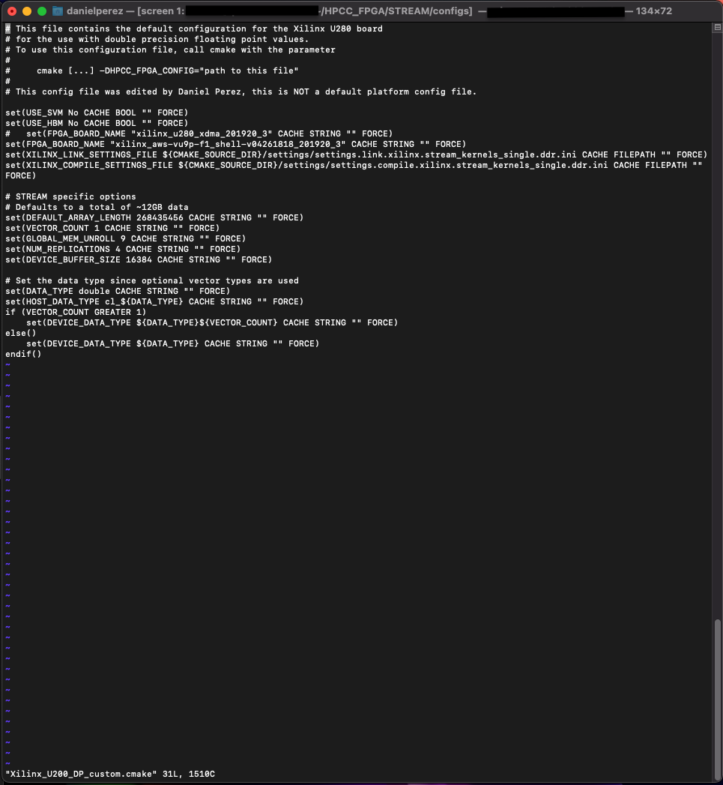

As can be seen in the image, I added line 12 of the file by copying the existing line and commenting out the pre-existing line there. This specific line specifies what platform file the Vitis compiler will look for when building the FPGA binaries. I edited this file to call the AWS shell platform instead of the Alveo U200 this configuration was made for. I made a few other changes to this configuration file that I will discuss later (this file is not the most updated config, I also later changed the filename as it did not accurately describe this config). 

When I first tried building again after changing the configuration files. I received a new error regarding the linking step in the vitis compilation process. Apart from the configuration files, the build process also makes use of specific "setting" files that can be found in the settings directory of each benchmark. These are the "compile" and the "link" setting files, there are multiple compile and link settings for each FPGA vendor and different options for the specific kernel. In the case of the STREAM benchmark, there were setting files for the use of HBM and DDR. HBM and DDR are both different types of memory found on an FPGA, in the case of the AWS F1 instance, the memory architecture makes use of DDR memory rather than HBM, which the default settings use. In order to switch which settings files are being used, one can either declare the new config while running cmake or change the path to the settings folder in the configuration file (the same one in the image above).

While the change from HBM to DDR settings is specific to the STREAM benchmark, in general, knowing the memory architecture of the AWS F1 instance is needed later on. Vitis actually includes a command for querying the available resources on a given platform, I believe this information is included somewhere in the platform folder. To access platform resources, invoke the `platforminfo [name of platform to be described]`. On my instance, I ran `platforminfo xilinx_aws-vu9p-f1_shell-v94261818_201920_3`, which provided me with the info needed to make further changes to the settings files. After referring to platforminfo, I found out that the AWS F1 instnaces actually only have DDR banks rather than HBM memory banks which led me to make the settings changes to the DDR files. Similar information about the AWS F1 memory architecture can be found [at this link](https://github.com/aws/aws-fpga/blob/master/Vitis/docs/Alveo_to_AWS_F1_Migration.md) from the AWS-FPGA github.  

After altering my editied config to use the DDR setting files, I received the following error: `ERROR: [CFGEN 83-2292] --sp tag applied to an invalid port or argument name: m_axi_gmem0`. The full error can be seen below: 

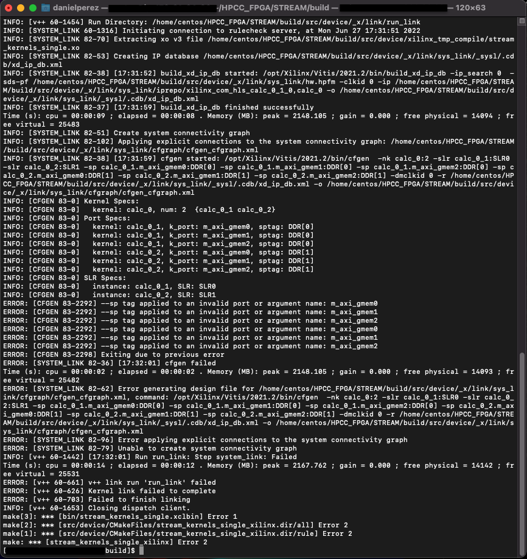

As can be seeen in the image above, the error involved an invalid argument name applied to an "sp-tag". According to the Vitis docs, an SP tag is usually the name of the type of memory available on the FPGA, in the case of the AWS F1 instance, the sp tag should be "DDR". The invalid argument name refers to the "m_axi_gmem0" part of each line in the .link settings file. The "m_axi_gmem" is a generic term for global memory when referring to vitis. This string is incorrect and causes the "invalid port or argument name" error. After referring to the source file [stream_kernels_single.cl](https://github.com/pc2/HPCC_FPGA/blob/master/STREAM/src/device/stream_kernels_single.cl), the function "void calc_" starting at line 27 tells us what we need to know to reconfigure the .link settings. Referring back to the .link settings, we know that the correct kernel is "calc_" as the INFO [CFGEN] lines in the image above say that this function is the kernel. We also know that the correct parameters are "in1", "in2", and "out". The .link settings refer to the these parameters as gmem0, gmem1, and gmem2 rather than in1, in2, and out. I believe that whoever made this .link settings file intended to use the generic names for the kernel's parameters, but for some reason, vitis declared the parameters as invalid. All we did was explicitly declare what the correct parameter names were. Me and Dr. Robson were able to deduce this after reviewing Vitis' behavior when the sp tags are not declared at all in the .link settings file (Vitis will try to infer the correct link settings and sp-tags), as well as the Vitis documentation and the source code for this kernel. 

The image below is the current iteration of the AWS F1 configuration file for the STREAM benchmark: 

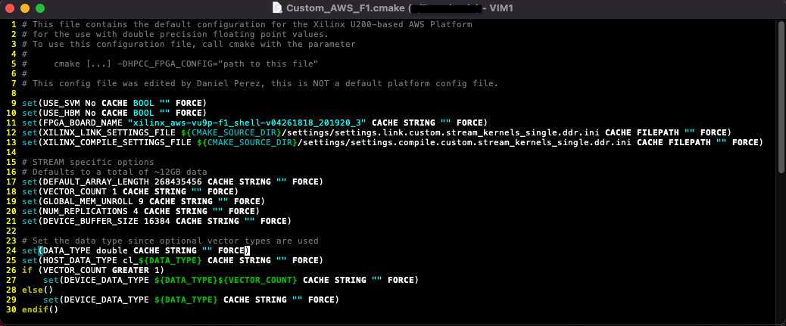

The main changes made to this file are changing the line that specifies the target platform, as well as the path to the custom .compile and .link files that I altered using existing settings. 

The image below is the current iteration of the .compile settings for the same platform and benchmark: 

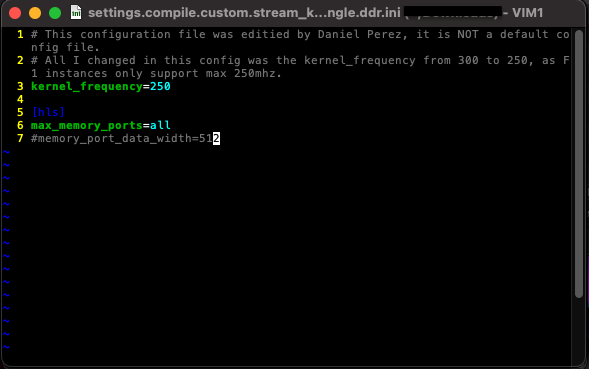 

All I changed in this file was the maximum frequency that the program is allowed to run. I changed it to 250mhz, as that is the reported max according to the AWS-FPGA github. 

The image below is the current iteration of the .link settings for the same platform and benchmark: 

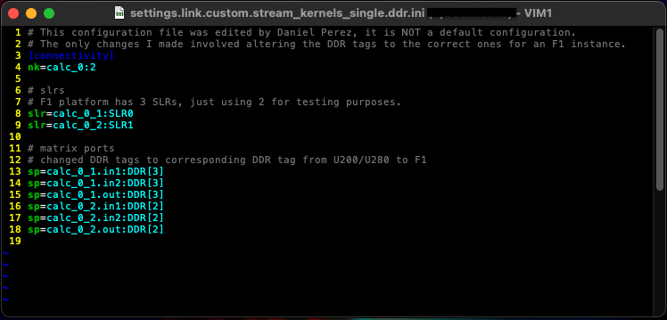

The changes made to this file are as described in the paragraph above the custom configuration file, these being changes to the sp-tag argument names from the generic name to the specific name seen in the kernel's source code.

After having corrected each of the configs and settings, I was able to run through most of the build process, but encountered an error `WARNING: [VPL 60-732] Link waning: No monitor points found for BD automation.` and `ERROR: [VPL 60-1328] Vpl run 'vpl' failed`. The full details can be found in the image below.  

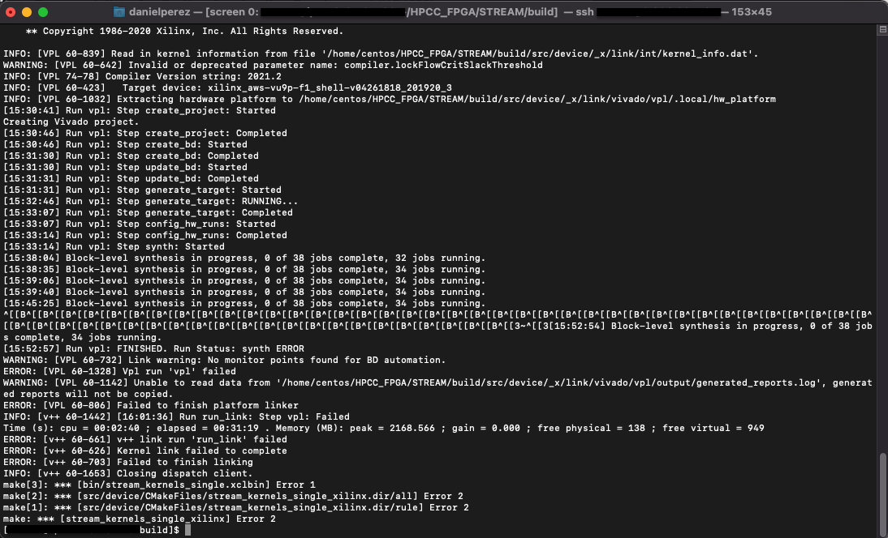  

The 'vpl' failed error is very generic and does not really include many details as to what exactly went wrong. I tried looking for logs but as can be seen in the warning line after the vpl error line, something went wrong with some of the log files and it has been difficult to pinpoint what exactly went wrong with the build. I am currently looking into the error, but after looking in one of the vivado logs, it appears that there is some sort of issue with the link settings that is causing other things to break. 

## HPCG_FPGA Testing Log

As an alternative to using the HPCC_FPGA suite of benchmarking tools, we tried using the HPCG ([High Performance Conguate Gradient Benchmark](https://github.com/Xilinx/HPCG_FPGA)). The main reasons why we felt we would have better luck with this benchmark over HPCC is because the HPCG-FPGA benchmark suite was actually created by Xilinx, whereas the HPCC benchmarks were not created exclusively for Xilinx FPGAs. Looking at the readme, the build process should actually be pretty simple, however we had to make various changes in order to get this benchmark to run correctly on AWS. 

Before getting started, MPI must be installed onto the VM, I ran `sudo yum install mpich-3.2-autoload mpich-3.0-devel`, then log out and log into the instance. 

The following commands will allow you to build the FPGA binaries (.xclbin) and the Host Application, although some configuration changes must be made to various configuration files that I will mention later on. 

Following the readme's instructions, assuming that the vitis setup script has already been run and the github repo has already been cloned, I ran the following commands in the HPCG-FPGA home directory: 
 
    make all TARGET=hw DEVICE=/opt/xilinx/platforms/xilinx_aws-vu9p-f1_shell-v04261818_201920_3/xilinx_aws-vu9p-f1_shell-v04261818_201920_3.xpfm

This will build the FPGA binaries, note that we used the DEVICE parameter rather than the PLATFORM parameter as instructed in the github's readme. This change must be made or the binaries will be built for an Alveo U280 rather than our AWS F1 platform. This is based on line 17 in the [home directory's Makefile](https://github.com/Xilinx/HPCG_FPGA/blob/main/Makefile), and the fact that the keyword PLATFORM is not in this Makefile.

To build the host application, the following commands must be run: 
    
    mkdir bin [DO NOT CD TO bin YET]
    make arch=FPGA_DOUBLE

You can change the precision of the host application by changing the "DOUBLE" to "SINGLE" as described in the readme. As previously mentioned, some configuration changes must be made before building the host application. Specifically, we need to change lines 68 - 71, the paths to the binary files. This is specifically referring to the path to the .xclbin (or in our case .awsxclbin) files when we actually try to execute the benchmark on the FPGA. If we are running on an F1 instance, you must first setup where you will place the .awsxclbin files on the F1 instance beforehand and enter it in the following lines. In my case, I created a "hpcg" folder on the home directory of my F1 instance at `/home/centos/hpcg`. I also made sure that the output name when generating the afi was the same as the kernel .cpp files before being built. For example, line 68 in my custom common.cpp file was `#define PATH_TO_BINARY_SPMV "/home/centos/hpcg/smpv.awsxclbin"`. Make sure to do this for the other 3 lines and their respective binary file. After we change the path, to each of the binary files the host application should be working. 

The following image is the common.hpp file, notice that we changed the #define PATH_TO_BINARY_X lines: 
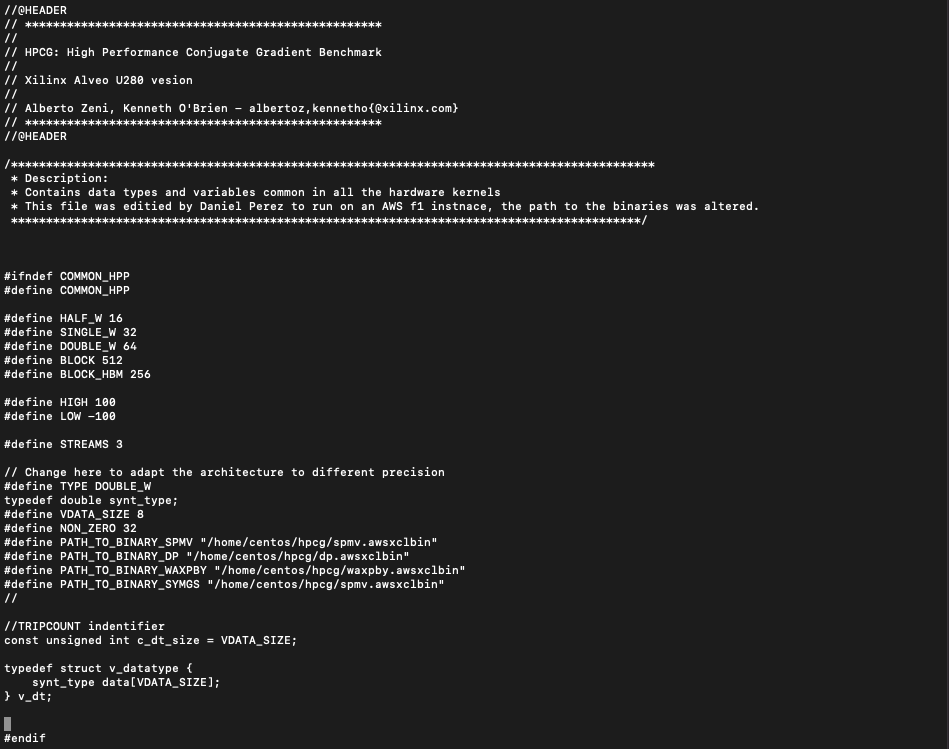 

For our AWS F1 platform, we also need to alter the Vitis/Vivado configuration files inside the [HPCC_FPGA/src-fpga/double](https://github.com/Xilinx/HPCG_FPGA/tree/main/src-fpga/double) directory. There are 4 configuration files we need to change which correspond to the 4 kernels, `dp.ini`, `spmv.ini`, `symgs.ini`, and `waxpby.ini`. The actual configuration files will be posted on our github repo [pending]. That being said, in order to know what changes to make, one must know the basics of the AWS F1 platform's floorplan and memory architecture. The F1 platform does not have HBM memory which this benchmark makes use of. We only have four DDR banks on our platform. We know this by running `platforminfo xilinx_aws-vu9p-f1_shell-v04261818_201920_3`. That means that we cannot use multiple kernels for this benchmark, as we do not have access to 32 HMB modules like the Alveo U280. 

In each of the configuration files, I left the original code commented out, the comments are denoted with a `#`. 

The image below describes dp.ini:
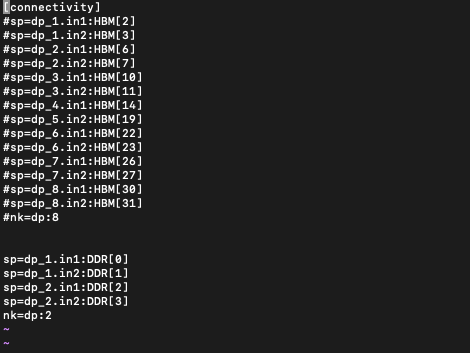 

The image below describes spmv.ini: 
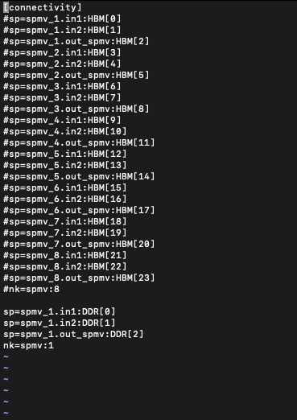

The image below describes symgs.ini: 
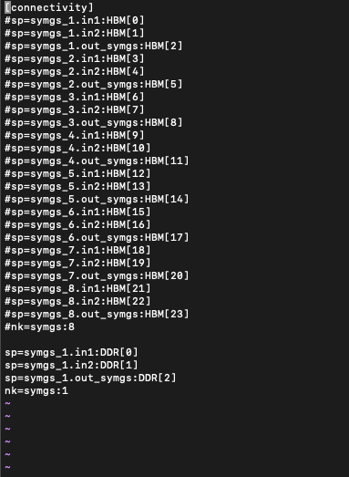

The image below describes waxpby.ini:
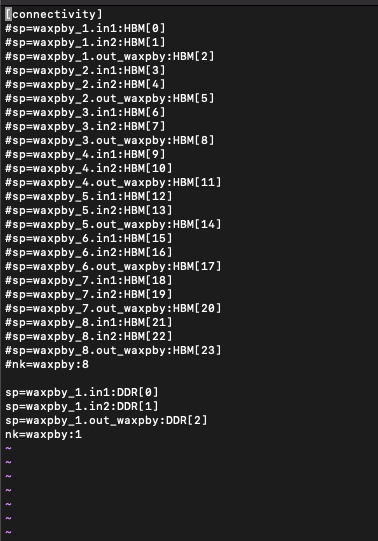

After changing the configuration files as well as the common.hpp file to change the path to the binaries on my F1 instance, I recevied the following error: 

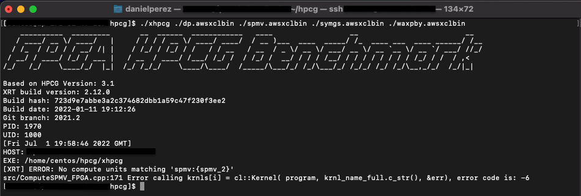

Error code -6 corresponds to the OpenCL host running out of resources, this combined with the error message regarding missing a second kernel, shows that either our configuration is incorrect, or we need to change src/ComputeSPMV_FPGA.cpp to only use 1 kernel or however many kernels correspond to our spmv.ini config file) rather than the 8 as defined in line 60 of the [ComputeSPMV_FPGA.cpp](https://github.com/Xilinx/HPCG_FPGA/blob/main/src/ComputeSPMV_FPGA.cpp) file. We will have to make this change to each of the four kernels. 

As previously mentioned, I had to make some changes to the link settings in order to get everything workng correctly. That being said, I also had to make additional changes to the kernel host files that were related to HBM memory. Specifically, the array "bank[]", then we need to change the parameters for the buffers that have already been created. The buffers are called something along the lines of "intBufExt1" and "intBufExt2", we need to change the .flag parameter to one of the bank_item objects in the bank[] array. 

After making multple changes to the kernels and link files, I made sure to run both software and hardware emulation in order to get the kernels up and running. I also tried building the kernels overnight a couple of times but made the mistake of leaving my screen active and attached while my local machine went to sleep. The software emulation made me aware of some of basic syntax errors which I corrected, and the hardware emulation gave me some conflicting insights on the link settings. Some of the automatically generated Vivado reports can be found in the build folder in the /src-fpga directory. You can also run the vitis_analyzer command and point it at the build directory which can give more insights on the link settings. 

In order to get vitis_analyzer working correctly, you must have access to either your AWS instance's GUI, or you must setup xquartz or another X Window manager through SSH. To get the vitis_analyzer to work on my instance with my setup (MacOS connected using xquartz: I installed xquartz using homebrew but still had issues getting the vitis_analyzer to work properly. In order to get everything working, I had to install xquartz locally, create an ssh config with a line that allows X11trusted [(I followed along using this SOF post).](https://stackoverflow.com/questions/39622173/cant-run-ssh-x-on-macos-sierra) I also had to run `sudo yum install xauth java` to make sure that the instance could recognize my xquartz connection and actually display the GUI. To connect to the instance and make use of xquartz, I have to connect to my instance using the command `ssh -X centos@[ip_to_instance]`, alternatively, the command  `ssh -Y centos@[ip_to_instance]`, the `-Y` switch means a trusted SSH connection and might work if `-X` does not work. 

After making some changes based on the vitis_analyzer, I re-built the kernels and host application and tried running again, but received a different error this time. The error was `[XRT] ERROR: std::bad alloc ... src/ComputeSMPV_FPGA.cpp:220 Error calling buffer_input[i] = cl::Buffer(context, CL_MEM_READ_ONLY | CL_MEM_EXT_PTR_XILINX | CL_MEM_USE_HOST_PTR, sizeof(synt_type) * dataSize, &inBufExt1[i], &err), error code is: -5`. At first, we believed that our FPGA was running out of memory, as error code -5 corresponds to the OpenCL runtime running out of resources, however, after referring to the [AWS F1 shell specifications](https://github.com/aws/aws-fpga/blob/master/FAQs.md), I figured out that our FPGA is not running out of memory, rather the memory allocation that I altered is not correct. Line 220 (referenced and printed out in the error above) basically means that the runtime could not allocate the memory for the buffer containing inBufExt1[i], this is the very first buffer that was allocated, so its very likely that this is a memory allocation problem rather than a memory capacity problem, as if this were a capacity issue, it is very likely that the runtime would have gotten to at least the second buffer then run out of memory. 

In order to best come up with a solution and a way to fix the file, I decided to rewrite my own version of the vector addition examples by instead trying vector subtraction. This was especially insightful as my understanding of not only the basics of OpenCL increased, but also of how the SPMV source code worked. I broke down the vadd example into parts that I understood, then compared them to the SPMV_FPGA. My custom vsub kernel can be seen in our Github repo [Link pending](), more details may also be found [here](/CustomApps) in our documentation.

After having made adjustments to each of the compute kernel host files, I was able to get the benchmark to run. A more detailed write up on the exact changes I had to make can be found in the [Modifying Apps for F1](/modApps) page. That being said, the HPCG benchmark is not 100% up and runnning just yet. I was able to implement a 1 and 2 kernel version that runs properly, however I have been having issues getting the benchmark to run with 3 kernels.   
